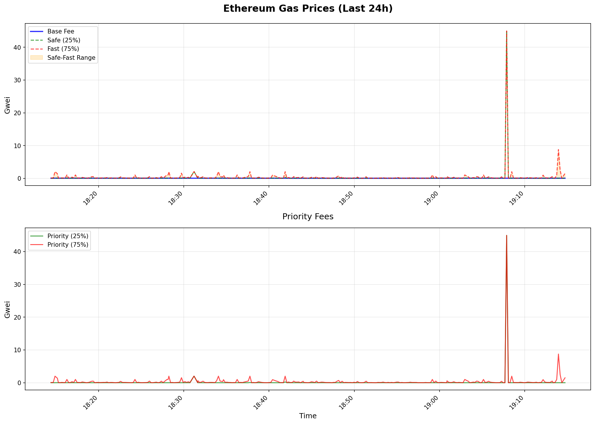
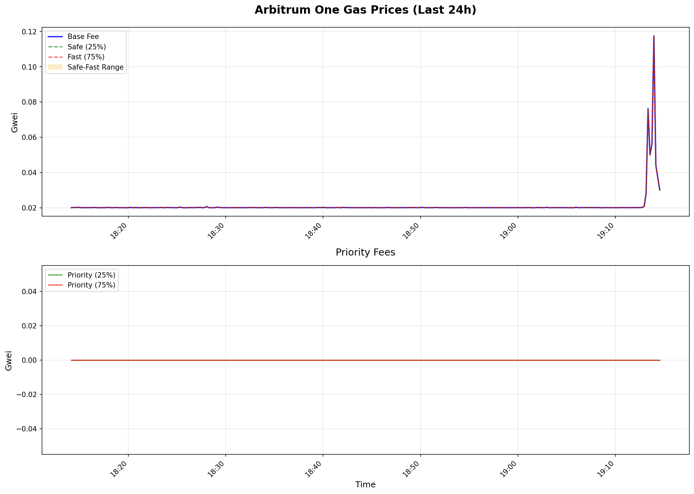
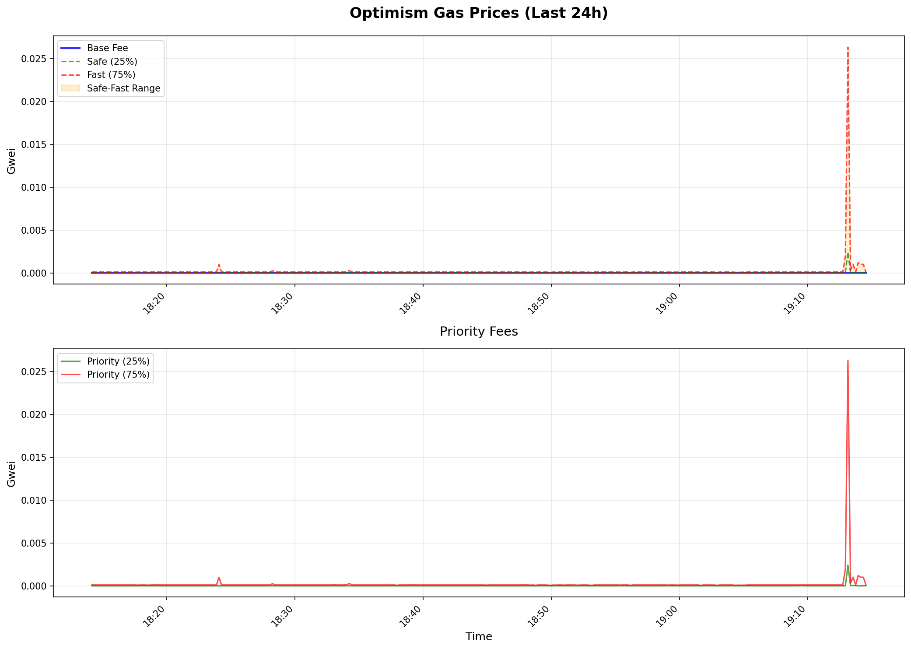

# Gas Monitor

**Professional multi-chain gas price monitoring with Telegram alerts and charts**

[](https://www.python.org/downloads/)
[](https://opensource.org/licenses/MIT)

[Features](#features) • [Installation](#quick-start) • [Configuration](#configuration) • [Documentation](#documentation)

---

## Features

**Multi-Chain Support**
- Monitor 5 networks simultaneously: Ethereum, Arbitrum, Optimism, Base, and Polygon
- Automatic failover between multiple RPC endpoints
- Network-specific threshold configuration

**Smart Alerts**
- Telegram notifications when gas prices drop below thresholds
- Configurable cooldown to avoid spam
- Rich message formatting with network details, block numbers, and recommendations
- Multiple alert levels: ultra_low, low, medium, high, ultra_high


**Data Visualization**
- Auto-generated charts with historical price trends
- Separate graphs for base fees, priority fees, and total fees
- Configurable update intervals and retention periods
- Support for multiple percentiles (p10, p25, p50, p75, p90)

**Sample Charts**

> Example outputs generated into `charts/` (your files will reflect your own runtime data).

<div align="center">
  
  
  
</div>

**Technical Features**
- EIP-1559 transaction support with base + priority fee tracking
- L2-specific calculations for Arbitrum, Optimism, and Base
- Asynchronous architecture for optimal performance
- Comprehensive logging with rotation
- Docker support for easy deployment
- Graceful shutdown handling

## Quick Start

### Prerequisites

- Python 3.9 or higher
- Telegram bot token and chat ID
- RPC endpoints (free public endpoints included)

### Local Installation

```bash
# Clone repository
git clone https://github.com/cppNexus/gas-monitor.git
cd gas-monitor

# Create virtual environment
python3 -m venv venv
source venv/bin/activate  # Windows: venv\Scripts\activate

# Install dependencies
pip install -r requirements.txt

# Configure
cp .env.example .env
nano .env  # Add your settings

# Run
python main.py
```

### Docker Installation

```bash
# Clone repository
git clone https://github.com/cppNexus/gas-monitor.git
cd gas-monitor

# Configure
cp .env.example .env
nano .env

# Start
docker-compose up -d

# View logs
docker-compose logs -f

# Stop
docker-compose down
```

## Configuration

### Telegram Setup

1. Create a bot via [@BotFather](https://t.me/BotFather)
   - Send `/newbot`
   - Choose name and username
   - Save the token

2. Get your chat ID via [@userinfobot](https://t.me/userinfobot)
   - Send `/start`
   - Copy your ID

3. Add to `.env`:
```env
TELEGRAM_BOT_TOKEN=123456789:ABCdefGHIjklMNOpqrsTUVwxyz
TELEGRAM_CHAT_ID=123456789
```

### RPC Endpoints

The project includes free public RPC endpoints. For better reliability, use your own:

```env
# Ethereum
ETHEREUM_RPC_1=https://eth.llamarpc.com
ETHEREUM_RPC_2=https://ethereum.publicnode.com

# Arbitrum
ARBITRUM_RPC_1=https://arb1.arbitrum.io/rpc
ARBITRUM_RPC_2=https://arbitrum.publicnode.com

# Optimism
OPTIMISM_RPC_1=https://mainnet.optimism.io
OPTIMISM_RPC_2=https://optimism.publicnode.com

# Base
BASE_RPC_1=https://mainnet.base.org
BASE_RPC_2=https://base.publicnode.com

# Polygon
POLYGON_RPC_1=https://polygon-rpc.com
POLYGON_RPC_2=https://polygon.publicnode.com
```

**Recommended Providers** (free tiers available):
- [Alchemy](https://www.alchemy.com/) - 300M compute units/month
- [Infura](https://infura.io/) - 100K requests/day
- [QuickNode](https://www.quicknode.com/) - Free trial

### Alert Thresholds

Default thresholds are configured in `config.py`. Customize per network:

**Ethereum:**
- ultra_low: 15 Gwei
- low: 20 Gwei
- medium: 35 Gwei
- high: 50 Gwei
- ultra_high: 100 Gwei

**L2 Networks (Arbitrum, Optimism, Base):**
- low: 0.1 Gwei
- medium: 0.3 Gwei
- high: 1.0 Gwei

### Monitoring Settings

```env
CHECK_INTERVAL=12           # Seconds between checks
ALERT_COOLDOWN=300         # Seconds between duplicate alerts
MAX_HISTORY_HOURS=24       # Hours of data to keep
ENABLE_ALERTS=true         # Enable/disable Telegram alerts
ENABLE_CHARTS=true         # Generate charts
CHART_UPDATE_INTERVAL=3600 # Seconds between chart updates
CHART_WIDTH=14             # Chart width (inches)
CHART_HEIGHT=8             # Chart height (inches)
CHART_DPI=150              # Chart resolution
CHART_DIRECTORY=charts     # Output directory for charts
```

## Usage

### Running Locally

```bash
# Activate virtual environment
source venv/bin/activate

# Start monitoring
python main.py

# Stop with Ctrl+C
```

### Running with Docker

```bash
# Start in background
docker-compose up -d

# View logs
docker-compose logs -f gas-monitor

# Restart
docker-compose restart

# Stop
docker-compose down

# Update and restart
git pull
docker-compose down
docker-compose build
docker-compose up -d
```

### As a System Service (Linux)

Create `/etc/systemd/system/gas-monitor.service`:

```ini
[Unit]
Description=Gas Monitor Service
After=network.target

[Service]
Type=simple
User=your_user
WorkingDirectory=/path/to/gas-monitor
Environment="PATH=/path/to/gas-monitor/venv/bin"
ExecStart=/path/to/gas-monitor/venv/bin/python main.py
Restart=always
RestartSec=10

[Install]
WantedBy=multi-user.target
```

Enable and start:
```bash
sudo systemctl daemon-reload
sudo systemctl enable gas-monitor
sudo systemctl start gas-monitor
sudo systemctl status gas-monitor
```

## Data Persistence

### Historical Data
- Stored in `data/history_backup.json`
- Automatically saved every 5 minutes
- Configurable retention period

### Charts
- Generated in `charts/` directory
- Updated hourly by default
- Automatic cleanup of old charts
- PNG format, configurable DPI

### Logs
- Console output and file logging
- Rotating file handler (10MB max, 5 backups)
- Configurable log level (DEBUG, INFO, WARNING, ERROR)
- Located in `logs/gas_monitor.log`

## Project Structure

```
gas-monitor/
│
├── main.py                  # Application entry point
│
├── src/                     # Source code
│   ├── config.py           # Configuration management
│   ├── monitor.py          # Core monitoring logic
│   ├── models.py           # Data models
│   ├── alerting.py         # Telegram notifications
│   ├── charts.py           # Chart generation
│   ├── l2_calculator.py    # L2 fee calculations
│   └── sniper.py           # Transaction sniper (optional)
│
├── docs/                    # Documentation
│   ├── README.ru.md        # Russian documentation
│   └── INSTALL.ru.md       # Russian installation guide
│
├── logs/                    # Logs (created automatically)
│   └── gas_monitor.log     # Main log file
│
├── charts/                  # Charts (created automatically)
│   ├── ethereum_gas_trend.png
│   ├── arbitrum_gas_trend.png
│   └── ...
│
├── data/                    # Data (created automatically)
│   └── history_backup.json # Historical data backup
│
├── requirements.txt         # Python dependencies
├── Dockerfile              # Docker image
├── docker-compose.yml      # Docker Compose configuration
├── .env.example            # Environment variables template
├── .gitignore             # Git ignore rules
├── .dockerignore          # Docker ignore rules
├── LICENSE                # MIT License
├── README.md              # English documentation
└── INSTALL.md             # English installation guide
```

### Directory Descriptions

**src/** - Main application code
- `config.py` - Load and validate configuration from .env
- `monitor.py` - Monitor gas prices across all networks
- `models.py` - Data models (GasData, etc.)
- `alerting.py` - Send notifications to Telegram
- `charts.py` - Generate charts with matplotlib
- `l2_calculator.py` - Calculate L1 fees for L2 networks
- `sniper.py` - Automated transactions (experimental)

**docs/** - Project documentation
- Installation guides
- User manuals
- API documentation

**logs/** - Log files
- Created automatically on first run
- Log rotation configured (10MB max, 5 backups)

**charts/** - Generated charts
- PNG files with gas price trends
- Automatic cleanup of old charts

**data/** - Application data
- Gas price history
- Configuration backups
- Data cache

## Troubleshooting

### RPC Connection Errors

**Problem:** `ClientConnectorDNSError` or `Unauthorized` errors

**Solution:**
1. Check your RPC endpoints in `.env`
2. Use alternative providers (see Configuration section)
3. Verify network connectivity

### No Telegram Alerts

**Problem:** Bot not sending messages

**Solution:**
1. Verify `TELEGRAM_BOT_TOKEN` and `TELEGRAM_CHAT_ID`
2. Test bot: `curl "https://api.telegram.org/bot<TOKEN>/getMe"`
3. Ensure bot is not blocked
4. For groups, add bot as admin

### Empty Charts

**Problem:** Charts are blank or show no data

**Solution:**
1. Wait 30-60 minutes for data accumulation
2. Check logs for errors
3. Verify `ENABLE_CHARTS=true` in `.env`

### High Memory Usage

**Problem:** Monitor consuming too much RAM

**Solution:**
```env
MAX_HISTORY_HOURS=12    # Reduce history
ENABLE_CHARTS=false     # Disable charts
CHECK_INTERVAL=30       # Increase interval
```

## Development

### Setup Development Environment

```bash
# Clone repository
git clone https://github.com/cppNexus/gas-monitor.git
cd gas-monitor

# Create virtual environment
python3 -m venv venv
source venv/bin/activate

# Install dependencies
pip install -r requirements.txt

# Run tests
python config.py  # Test configuration
python main.py    # Test full run
```

### Code Style

- Follow PEP 8
- Use type hints where possible
- Document functions with docstrings
- Keep functions under 50 lines

### Adding New Networks

1. Add network configuration in `config.py`:
```python
networks["new_network"] = NetworkConfig(
    name="New Network",
    chain_id=123,
    native_token="TOKEN",
    is_l2=False,
    supports_eip1559=True,
    block_time=12,
    explorer_url="https://explorer.example.com",
    gas_thresholds={"low": 10, "medium": 20, "high": 50}
)
```

2. Add RPC endpoints in `.env.example`
3. Test with `python main.py`

## Security

### Best Practices

- Never commit `.env` file to git
- Use environment variables for secrets
- Keep dependencies updated
- Use dedicated wallet for sniper (if enabled)
- Enable 2FA on Telegram account

### Sniper Mode Warning

The sniper module is experimental and disabled by default. If you enable it:
- ALWAYS use `dry_run=true` for testing
- Never store private keys in code
- Use a separate wallet with minimal funds
- Understand the risks of automated transactions

## Sniper Module

The sniper module allows automatic transaction execution when gas prices drop below target levels. This is an advanced feature for experienced users.

### Features

- Automatic transaction sending on low gas prices
- EIP-1559 transaction support
- Nonce management with collision prevention
- Transaction simulation before sending
- Confirmation system for safety
- Dry-run mode for testing
- Balance checking
- Gas estimation
- Multiple safety checks

### Configuration

**Enable Sniper:**
```env
ENABLE_SNIPER=false              # Set to true to enable
SNIPER_DRY_RUN=true              # ALWAYS true for testing
SNIPER_REQUIRE_CONFIRMATION=true # Require manual confirmation
SNIPER_CONFIRMATION_TTL=30       # Seconds to confirm
SNIPER_MAX_GAS_MULTIPLIER=1.2    # Max gas price multiplier
SNIPER_MIN_PROFIT_GWEI=5.0       # Minimum profit in Gwei
```

**CRITICAL: Never set private key in .env file!**

### Usage Example

```python
from sniper import get_sniper

# Initialize sniper
sniper = await get_sniper(network="ethereum")

# Set private key (DO THIS SECURELY!)
# For testing only - use hardware wallet in production
sniper.set_private_key("YOUR_PRIVATE_KEY")

# Check balance
balance = await sniper.get_balance()
print(f"Balance: {balance} ETH")

# Prepare transaction
tx = await sniper.prepare_transaction(
    to_address="0x...",
    value_eth=0.01,
    gas_limit=21000
)

# Simulate first
success, error = await sniper.simulate_transaction(tx)
if success:
    # Send transaction (dry-run mode won't actually send)
    tx_hash = await sniper.send_transaction(tx)
    
    # Wait for confirmation
    if tx_hash:
        confirmed = await sniper.wait_for_transaction(tx_hash)
        print(f"Transaction confirmed: {confirmed}")
```

### Dry-Run Mode

In dry-run mode (default), the sniper will:
- Prepare transactions
- Simulate execution
- Log all details
- NOT send transactions to the network

This allows safe testing without risking funds.

### Safety Features

1. **Nonce Management**: Automatic nonce tracking prevents transaction collisions
2. **Gas Estimation**: Calculates optimal gas limits
3. **Simulation**: Tests transaction before sending
4. **Confirmation System**: Requires manual approval for each transaction
5. **Balance Checks**: Verifies sufficient funds before sending
6. **Cooldown Periods**: Prevents spam transactions
7. **Error Recovery**: Automatic nonce reset on failures

### Production Use

For production use with real funds:

1. **Use Hardware Wallet**
   - Ledger or Trezor recommended
   - Never expose private keys

2. **Dedicated Wallet**
   - Create separate wallet for sniper
   - Keep minimal funds (only what you plan to use)

3. **Test Thoroughly**
   - Run in dry-run mode for days
   - Test on testnet first
   - Verify all logic

4. **Monitor Constantly**
   - Watch logs in real-time
   - Set up alerts for failures
   - Have kill switch ready

5. **Security Checklist**
   - [ ] Using hardware wallet or secure key management
   - [ ] Tested thoroughly in dry-run mode
   - [ ] Separate wallet with minimal funds
   - [ ] Monitoring and alerts configured
   - [ ] Understanding of all risks
   - [ ] Emergency stop procedure ready

### Example Scenarios

**Scenario 1: NFT Minting**
```python
# When gas drops below 20 Gwei, mint NFT
if current_gas < 20:
    tx = await sniper.prepare_transaction(
        to_address="0xNFTContract",
        value_eth=0.08,  # Mint price
        data="0x...",    # Mint function call
        gas_limit=150000
    )
    await sniper.send_transaction(tx)
```

**Scenario 2: Token Swap**
```python
# Execute swap when gas is optimal
if current_gas < target_gas:
    tx = await sniper.prepare_transaction(
        to_address="0xUniswapRouter",
        data="0x...",  # Swap calldata
        gas_limit=200000
    )
    await sniper.send_transaction(tx)
```

**Scenario 3: Arbitrage**
```python
# Check opportunity and profit
opportunity, profit = await sniper.check_opportunity(
    current_gas_price=current_gas,
    target_gas_price=target_gas
)

if opportunity and profit > sniper.config.min_profit_gwei:
    # Execute arbitrage
    tx = await sniper.prepare_transaction(...)
    await sniper.send_transaction(tx)
```

### Limitations

- Does not guarantee transaction inclusion
- Subject to network congestion
- Frontrunning risk exists
- Gas price can change between preparation and sending
- Slippage on DEX trades

### Troubleshooting Sniper

**Problem: Transaction fails with "nonce too low"**
```python
# Reset nonce manager
sniper.nonce_manager.reset_nonce()
```

**Problem: Gas estimation fails**
```python
# Use manual gas limit
tx = await sniper.prepare_transaction(
    ...,
    gas_limit=300000  # Set manually
)
```

**Problem: Transaction pending too long**
```python
# Increase gas price multiplier
# In .env:
SNIPER_MAX_GAS_MULTIPLIER=1.5
```

### Legal Disclaimer

**USE AT YOUR OWN RISK**

The sniper module is provided as-is without warranties. Users are responsible for:
- Understanding smart contract risks
- Complying with local regulations
- Securing private keys
- Managing funds safely

The authors are not liable for any losses incurred through use of this software.

### Security

**Q: How many networks can I monitor simultaneously?**
A: All 5 networks (Ethereum, Arbitrum, Optimism, Base, Polygon) run in parallel.

**Q: What are the system requirements?**
A: Minimum 512MB RAM, 1GB disk space. Recommended: 1GB RAM, 5GB disk for long-term history.

**Q: Can I monitor only specific networks?**
A: Yes, simply don't configure RPC endpoints for unwanted networks in `.env`.

**Q: How accurate are the gas predictions?**
A: We use actual on-chain data from `eth_feeHistory`. Accuracy depends on network conditions and RPC reliability.

**Q: Can I run multiple instances?**
A: Yes, use different `.env` files and Telegram bots for each instance.

**Q: Does it work on Windows?**
A: Yes, but Docker is recommended for production use.

## Performance

**Typical Resource Usage:**
- CPU: <5% on modern processors
- RAM: 50-200MB depending on history size
- Network: ~1-5 KB/s per network
- Disk: ~100MB for 24h history

**Optimization Tips:**
- Use local RPC nodes for best performance
- Increase `CHECK_INTERVAL` to reduce load
- Disable charts if not needed
- Use SSD for faster I/O

## Contributing

Contributions are welcome! Please:

1. Fork the repository
2. Create a feature branch (`git checkout -b feature/AmazingFeature`)
3. Commit changes (`git commit -m 'Add AmazingFeature'`)
4. Push to branch (`git push origin feature/AmazingFeature`)
5. Open a Pull Request

### Contribution Guidelines

- Follow existing code style
- Add tests for new features
- Update documentation
- Keep commits atomic and well-described

## Roadmap

- [ ] Support for more L2 networks (zkSync, Polygon zkEVM)
- [ ] Web dashboard for chart viewing
- [ ] Database backend for long-term storage
- [ ] Discord integration
- [ ] Mobile app
- [ ] Gas price predictions with ML
- [ ] Multi-language support
- [ ] RESTful API

## License

This project is licensed under the MIT License - see the [LICENSE](LICENSE) file for details.

## Acknowledgments

- [Web3.py](https://github.com/ethereum/web3.py) - Ethereum library for Python
- [aiohttp](https://github.com/aio-libs/aiohttp) - Async HTTP client/server
- [matplotlib](https://matplotlib.org/) - Chart generation

## Support

- Issues: [GitHub Issues](https://github.com/cppNexus/gas-monitor/issues)
- Discussions: [GitHub Discussions](https://github.com/cppNexus/gas-monitor/discussions)
- Email: cppnexus@proton.me

---

**Star this repo if you find it useful!**
